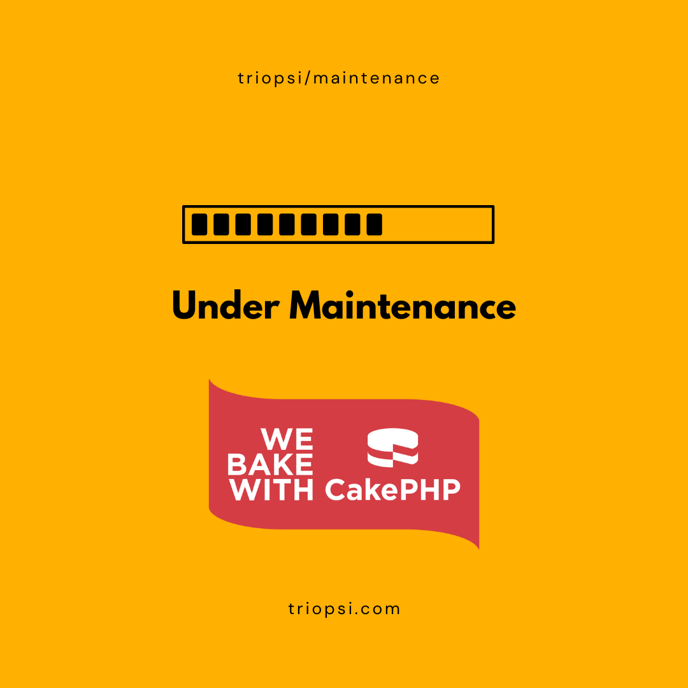

# Maintenance plugin for CakePHP

A maintenance mode for your CakePHP application. With this plugin you can put your app into maintenance mode. With a whitelist you can also determine who can still access your application. It comes to you with a component, console and middleware.

> Warning: This tool should not be used if the DB connection or your application goes down completely due to upgrades.
There it would fail hard. It should only be used for soft maintenance work.

<p align="center">
    
</p>

## Installation

You can install this plugin into your CakePHP application using [composer](https://getcomposer.org).

The recommended way to install composer packages is:

```
composer require triopsi/maintenance
```

## Load Plugin via bin/bake
Via the load task you are able to load plugins in your application.php. You can do this by running:
```
bin/cake plugin load Maintenance
```

### Manually Installing
If the plugin you want to install is not available on packagist.org, you can clone or copy the plugin code into your plugins directory. */plugin/*

Put this in the application.php in the bootstrap method:
```php
$this->addPlugin('Maintenance');
```
If we were installing the plugin manually you would need to modify our application’s composer.json file to contain the following information:
```
 "autoload": {
        "psr-4": {
            ...            
            "Maintenance\\": "plugins/Maintenance/src/"
        }
    },
    "autoload-dev": {
        "psr-4": {
            ...
            "Maintenance\\Test\\": "plugins/Maintenance/tests/"
        }
    },
```
Additionally, you will need to tell Composer to refresh its autoloading cache:
```
php composer.phar dumpautoload
```

## Customizing
Make sure you have a template file in `/templates/Error/` named `maintenance.php`.

Configs:
- `className`: Sets the view classname.Accepts either a short name (Ajax) a plugin name (MyPlugin.Ajax) or a fully namespaced name (App\View\AppView) or null to use the View class provided by CakePHP.
- `templatePath`: Sets path for template file. e.g. /template/Error.
- `statusCode`: HTTP Response Code for the http header.
- `templateLayout`: Layoutname or false for use default layout.
- `templateFileName`: Teamplet name for maintenance mode.
- `templateExtension`: View template extension.
- `contentType`: Response Type. The MIME type of the resource or the data.
- `api_prefix`: API Url Suffix. Maintenance Mode are disable for this prefix. Type false for disable exceptions.

Those can be used to adjust the content of the maintenance mode page.
## Maintenance Component
This component adds functionality on top:
- A flash message shows you if you are currently whitelisted in case maintenance mode is active (and you just don't see it due to the whitelisting).
### How to setup
```php
// In your App Controller Class (/src/Controller/AppController)
public function initialize() {
    ...
    $this->loadComponent( 'Maintenance.Maintenance' );
}
```
### Diable the Flash message
Write in the `/config/app.php` a variable like:
```
maintenance => array(
	'flash' => false
)
```
or in the initialize method in `/src/Controller/AppController`:
```
Cake\Core\Configure::write( 'maintenance.flash', true )
```
Instead of a flash message, something else can also be triggered. 
A view variable named `maintenance_mode` is written in the component. With the help of this variable it is possible to query the status in the template files. This could look something like this:

```
// in the layout or view file:
<?php
if (isset( $maintenance_mode ) && true === $maintenance_mode ) {
?>
<div class="bg-warning text-center">
	<?php echo __( 'Maintenance Modus is active' ); ?>
</div>
<?php
}
?>
```
## MaintenanceMode Commands
This should be the preferred way of enabling and disabling the maintenance mode for your application.

Commands
- status
- activate
- deactivate
- whitelist
- reset

### Help Page
```
Usage:
cake maintenance_mode [-d 0] [-h] [-q] [-r] [-v] <status|activate|deactivate|reset|whitelist> [<ip_addresses>]

Options:

--duration, -d  Duration in minutes - optional.
--help, -h      Display this help.
--quiet, -q     Enable quiet output.
--remove, -r    Remove IP Addresses from whitelist.
--verbose, -v   Enable verbose output.

Arguments:

activity      See the current status (choices: status|activate|deactivate|reset|whitelist)
ip_addresses  A comma separated list of ip addresses for the whitelist.
(optional)
```

### Examples

Example for activating the maintenance mode:
```
./bin/cake maintenance_mode activate
```
Or with Timout (5 minutes)
```
./bin/cake maintenance_mode -d 5 activate
```
Disable maintenance mode
```
./bin/cake maintenance_mode deativate
```
Or Reset the mode (disable maintenance mode and delete all whitelist ip addresses)
```
./bin/cake maintenance_mode reset
```
Add ip address in the whitelist
```
./bin/cake maintenance_mode whitelist 127.0.0.1
```
Add ip addresses in the whitelist
```
./bin/cake maintenance_mode whitelist 127.0.0.1,127.0.0.2,127.0.0.3
```
Remove a ip address from the whitelist
```
./bin/cake maintenance_mode -r whitelist 127.0.0.1
```
List all ip addresses
```
./bin/cake maintenance_mode whitelist
```
Get status
```
./bin/cake maintenance_mode status
```